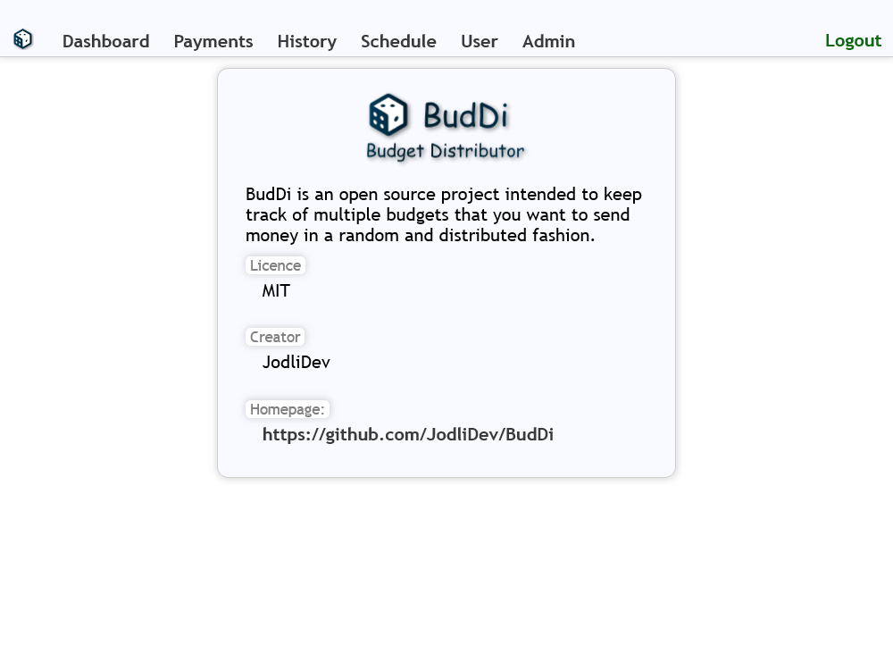
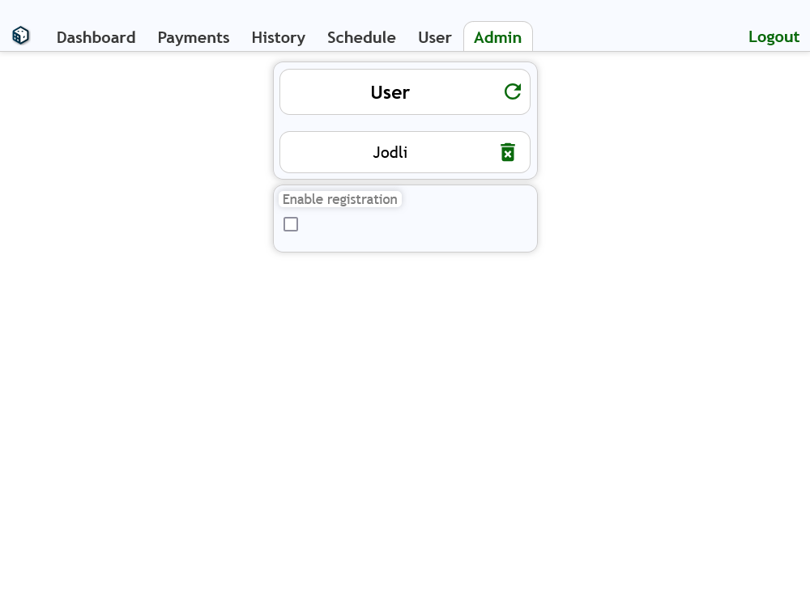
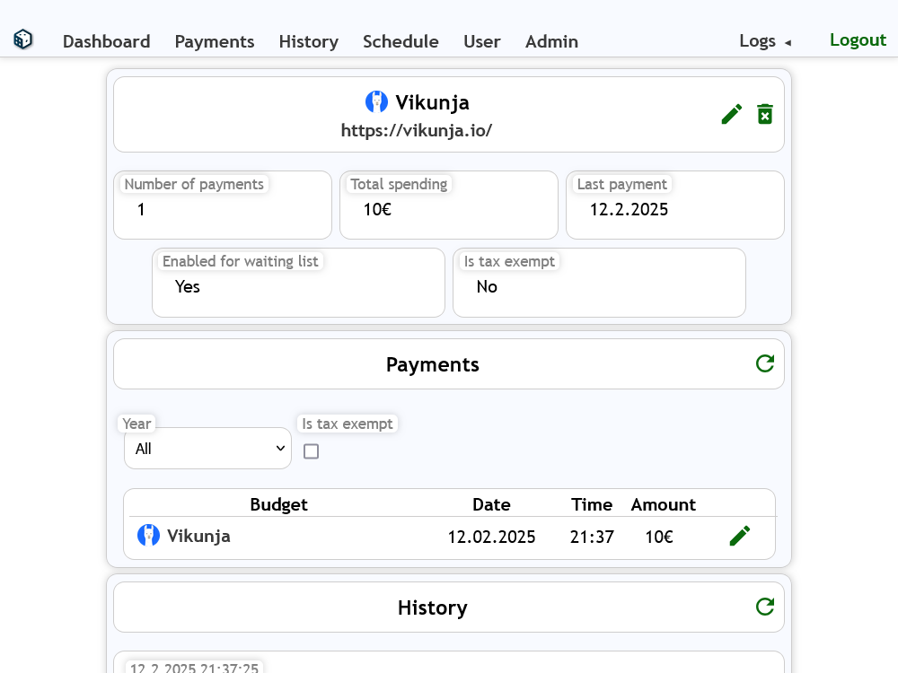
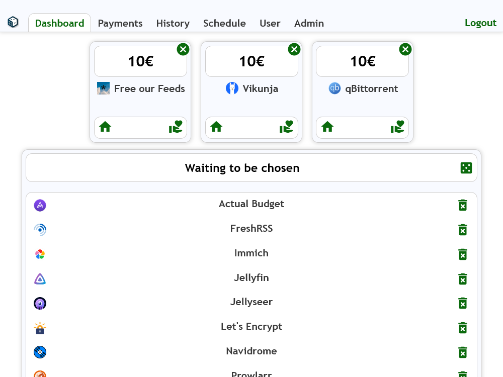
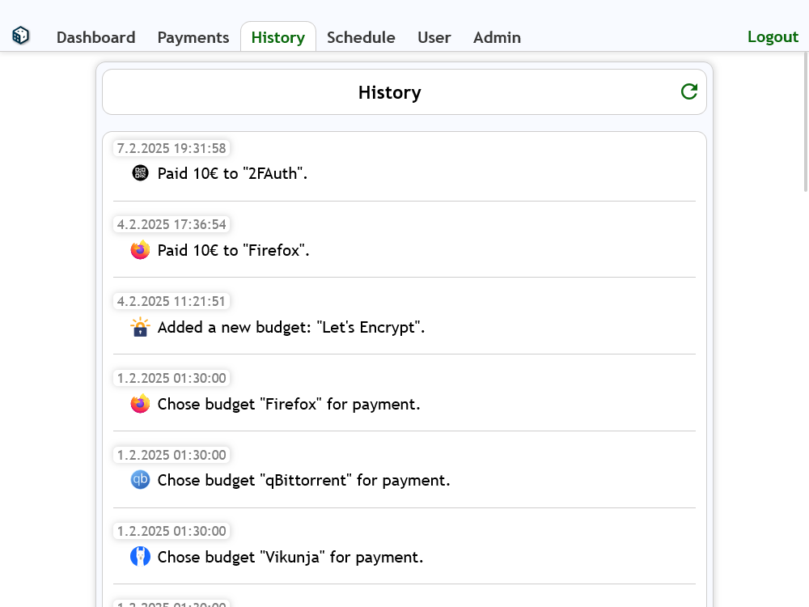
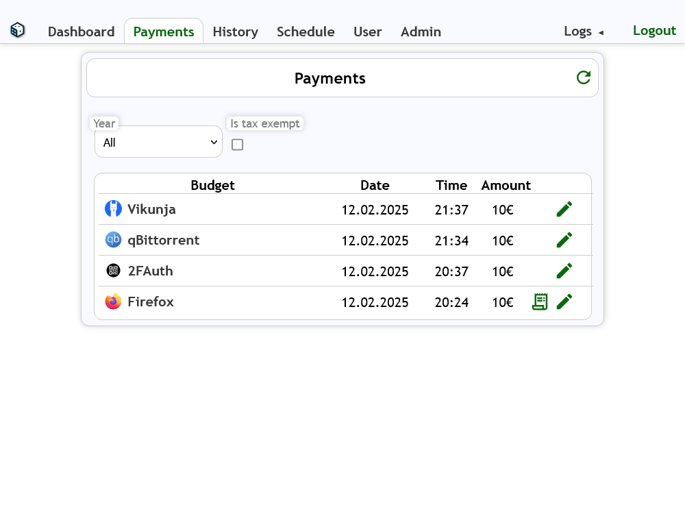
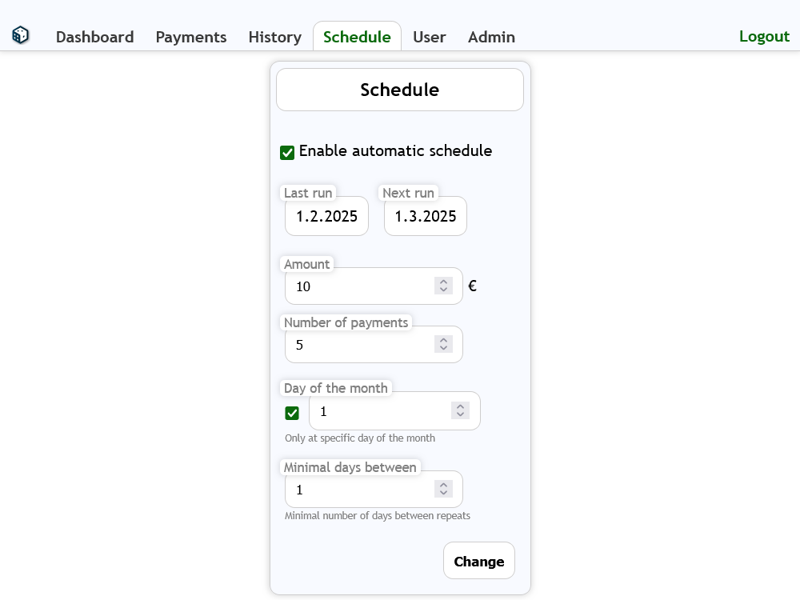
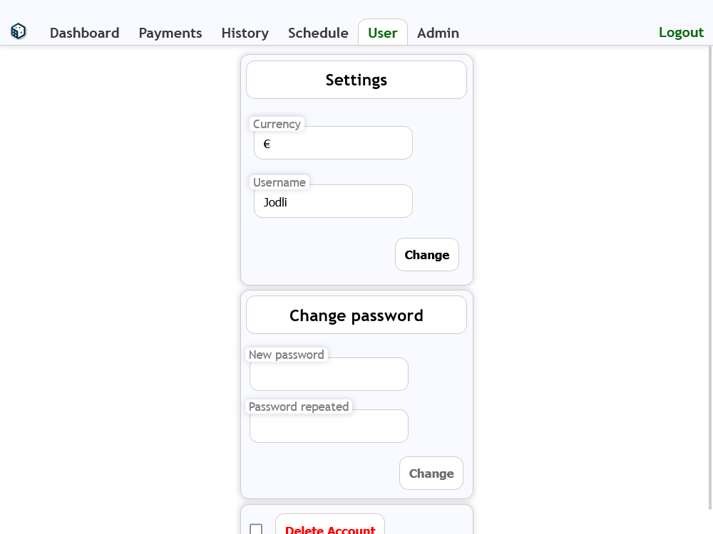

<p align="center">

</p>

BudDi is a web platform intended to automatically fill random budgets (either manually or regularly) and keep track of expenses.

For example, you can use it to organize all projects or organisations you want to donate money to. BudDi will make sure that your donations are distributed equally between all projects. And if you want to use an automated schedule, it will also randomly choose the next projects you want to donate to depending on the time schedule that you have set.

> Note: I developed this project mostly for my personal use. ~~When it has been running bug-free for a while~~It has been running smoothly for a while now so I ~~will~~ consider BudDi feature complete. I might add features if new needs arise or if somebody has interesting ideas (please open a new issue).

## How does it work?
BudDi keeps two lists: "All budgets" and "Waiting to be chosen".
Entries that are added to the "All budgets" section will also be added to "Next up" automatically.
Every time you press the "Select random spending now" button (or when the scheduler does it automatically), one random entry is removed from the "Waiting to be chosen" list. Also, BudDi prompts you to pay money to this budget (by adding it to a third list at the top that can be checkmarked).
When the list "Waiting to be chosen" is empty, it will automatically be refilled with the entries from "All budgets" and the cycle restarts.

## Features
- Create budgets and randomly choose them for payment (in an equally distributed fashion).
- A Scheduler that randomly chooses X budgets every Y days (at 00:30) for payment.
- Upload recipes for payments.
- Filter payments for a specific year, by budget or tax-exempt state.
- Set down payments for budgets which will be calculated against random spending.
- A detailed history of expenses and budgets.
- User management.

## Screenshots

<p align="center">
	<a href="images/screenshots/about.png" target="_blank">
		
	</a>
	<a href="images/screenshots/admin.png" target="_blank">
		
	</a>
	<a href="images/screenshots/budget.png" target="_blank">
		
	</a>
	<a href="images/screenshots/dashboard.png" target="_blank">
		
	</a>
	<a href="images/screenshots/history.png" target="_blank">
		
	</a>
	<a href="images/screenshots/payments.png" target="_blank">
		
	</a>
	<a href="images/screenshots/schedule.png" target="_blank">
		
	</a>
	<a href="images/screenshots/user.png" target="_blank">
		
	</a>
</p>

## How to install?
The easiest way is to use docker compose.

Create a new directory and move there:
```shell
mkdir ./buddi
cd ./buddi
```

Download the docker compose file:
```shell
wget -O https://raw.githubusercontent.com/JodliDev/BudDi/refs/heads/master/docker-compose.yml
```

Run the container:
```shell
docker compose up -d
```


Then, open <http://localhost:1304>.
- The first user that is created will have admin permissions.
- If you want to register other users, you have to enable registrations in the admin section (<http://localhost:1304#Admin>)

### (Optional) Using a reverse Proxy (e.g., Nginx)
Use the following configuration (assuming that you use TLS and you want to use **Let's Encrypt**):
> **Note 1:** Replace SERVERNAME with your domain:

> **Note 2:** `/websocket` needs to match the option `pathWs`

> **Note 3:** `1304` needs to match the option `portHttp`
```
server {
    server_name SERVERNAME;
    listen 443;
    listen [::]:443;


    location / {
        proxy_set_header HOST $host;
        proxy_set_header X-Forwarded-Proto https;
        proxy_set_header X-Real-IP $remote_addr;
        proxy_set_header X-Forwarded-For $proxy_add_x_forwarded_for;
        proxy_set_header X-Forwarded-Host $server_name;
        proxy_set_header Upgrade $http_upgrade;
        proxy_pass http://127.0.0.1:1304;
    }
    
    location /websocket {
        proxy_pass http://127.0.0.1:1304;
        proxy_http_version 1.1;
        proxy_set_header Upgrade $http_upgrade;
        proxy_set_header Connection "upgrade";
        proxy_set_header Host $host;
        proxy_set_header X-Real-IP $remote_addr;
        proxy_set_header X-Forwarded-For $proxy_add_x_forwarded_for;
        proxy_set_header X-Forwarded-Proto https;
        proxy_set_header X-Forwarded-Protocol https;
        proxy_set_header X-Forwarded-Host $server_name;
    }
    
    ssl_certificate /etc/letsencrypt/live/SERVERNAME/fullchain.pem;
    ssl_certificate_key /etc/letsencrypt/live/SERVERNAME/privkey.pem;
    include /etc/letsencrypt/options-ssl-nginx.conf;
    ssl_dhparam /etc/letsencrypt/ssl-dhparams.pem;

}
server {
    server_name SERVERNAME;
    listen 80;
    listen [::]:80;

    return 301 https://$host$request_uri;
}

```

## Options
Can be set in the environment section in `docker-compose.yml`:
- **keepAliveTimeoutMs**: Milliseconds after which the frontend should send keep-alive packages to prevent websocket being closed (e.g., nginx closes connections after one minute) (default: "50000").
- **lang**: Language code to select a translation for the frontend (currently there is only "en") (default: "en").
- **pathWs**: Relative path on which the websocket should be accessible (default: "/websocket").
- **portHttp**: Internal port on which the application should run in the docker image (default: 1304).


## How to update?
>**Note 1:** Database updates happen automatically. When BudDi upgrades its database, it automatically creates a backup of its database file (found in `buddi/config`).

>**Note 2:** When starting, BudDi logs all database changes to the console.

Download a new image for the container and restart:
```shell
docker compose pull && docker compose up -d --remove-orphans
```

Delete unused Docker images:
```shell
docker image prune
```

## What is it made of?
The backend is written in TypeScript using Node.js, which starts an HTTP and WebSocket server using Express and ws. Data is saved using SQLite.
The frontend is written in TypeScript using Mithril.js.
Both backend and frontend are packed and minified via Webpack.
